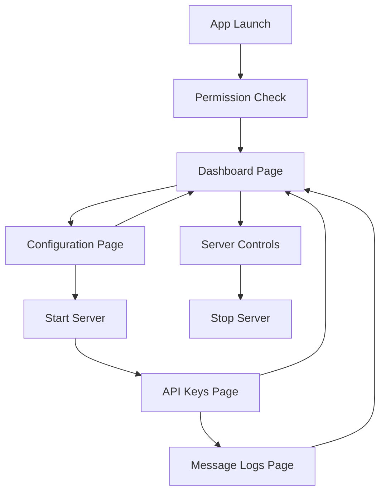

# Flutter SMS Gateway - Product Requirements Document

## 1. Product Overview

A Flutter mobile application that transforms an Android device into a professional SMS gateway service, enabling external applications to send SMS messages through REST API endpoints over Wi-Fi networks.

The app solves the challenge of bulk SMS sending for desktop applications by leveraging mobile device SMS capabilities, providing a cost-effective alternative to commercial SMS services while maintaining full control over message delivery and security.

Target market: Developers, small businesses, and organizations requiring reliable bulk SMS functionality with local network control and enhanced privacy.

## 2. Core Features

### 2.1 User Roles

| Role | Registration Method | Core Permissions |
|------|---------------------|------------------|
| Device Owner | Direct app installation | Full access to all features, server configuration, API key management |
| API Client | API key authentication | Send SMS requests, view delivery status via API responses |

### 2.2 Feature Module

Our SMS Gateway application consists of the following main pages:

1. **Dashboard Page**: Server status display, device information, daily SMS statistics, quick server controls
2. **Configuration Page**: API settings, SIM card selection, security configuration, port management
3. **Message Logs Page**: SMS history, delivery status tracking, message details, filtering options
4. **API Keys Page**: Authentication token management, key generation, access control settings

### 2.3 Page Details

| Page Name | Module Name | Feature description |
|-----------|-------------|---------------------|
| Dashboard Page | Server Status Panel | Display server running status, IP address, port number, start/stop controls |
| Dashboard Page | Device Information | Show device name, model, network IP, SIM card status, connectivity info |
| Dashboard Page | Statistics Widget | Display daily SMS count, success rate, failed messages, total processed |
| Dashboard Page | Quick Actions | Start/stop server buttons, emergency stop, server restart functionality |
| Configuration Page | API Settings | Configure server port, timeout settings, concurrent request limits |
| Configuration Page | SIM Management | Select active SIM card, dual SIM support, carrier information display |
| Configuration Page | Security Settings | API key requirements, rate limiting configuration, IP whitelist management |
| Configuration Page | Message Settings | Default message settings, retry attempts, delivery confirmation options |
| Message Logs Page | Message History | List all sent messages with timestamps, recipients, status indicators |
| Message Logs Page | Status Tracking | Real-time delivery status updates, failed message identification, retry options |
| Message Logs Page | Search & Filter | Filter by date, status, recipient, message content, export functionality |
| Message Logs Page | Message Details | Individual message view with full details, delivery reports, error logs |
| API Keys Page | Key Management | Generate new API keys, revoke existing keys, key expiration settings |
| API Keys Page | Access Control | Set permissions per key, usage limits, client identification |
| API Keys Page | Usage Analytics | Track API usage per key, request statistics, rate limit monitoring |

## 3. Core Process

**Device Owner Flow:**
1. Install and launch the SMS Gateway app
2. Grant necessary permissions (SMS, Phone, Storage)
3. Configure API settings (port, security, SIM selection)
4. Generate API keys for client applications
5. Start the HTTP server service
6. Monitor SMS activity and server status
7. Manage message logs and troubleshoot issues

**API Client Flow:**
1. Obtain API key from device owner
2. Connect to device IP address and configured port
3. Send authenticated HTTP requests to SMS endpoints
4. Receive confirmation responses with message IDs
5. Monitor delivery status through API responses
6. Handle rate limiting and error responses

## 4. User Interface Design

### 4.1 Design Style

- **Primary Colors**: Material 3 Dynamic Color (Blue #1976D2, Green #4CAF50 for success, Red #F44336 for errors)
- **Secondary Colors**: Grey #757575 for text, Light Blue #E3F2FD for backgrounds
- **Button Style**: Material 3 filled buttons with rounded corners (8px radius), elevated cards with subtle shadows
- **Font**: Roboto family - 16sp for body text, 20sp for titles, 14sp for captions
- **Layout Style**: Card-based design with consistent 16dp margins, top navigation with bottom navigation tabs
- **Icons**: Material Design icons with outlined style, status indicators with color coding (green/red/orange)

### 4.2 Page Design Overview

| Page Name | Module Name | UI Elements |
|-----------|-------------|-------------|
| Dashboard Page | Server Status Panel | Large status card with green/red indicator, IP address in monospace font, toggle switch for server control |
| Dashboard Page | Device Information | Compact info cards showing device model, SIM status with carrier logos, network connectivity icons |
| Dashboard Page | Statistics Widget | Circular progress indicators for daily limits, number counters with animated transitions, success rate charts |
| Configuration Page | API Settings | Number input fields with validation, slider controls for limits, dropdown menus for options |
| Configuration Page | SIM Management | Radio button selection with SIM card icons, carrier information display, signal strength indicators |
| Configuration Page | Security Settings | Text input for API keys, toggle switches for security features, expandable sections for advanced options |
| Message Logs Page | Message History | List tiles with status icons, timestamp formatting, swipe actions for details, pull-to-refresh functionality |
| Message Logs Page | Status Tracking | Color-coded status badges, progress indicators for pending messages, retry buttons for failed items |
| API Keys Page | Key Management | Card layout for each key, copy-to-clipboard buttons, QR code generation for easy sharing |

### 4.3 Responsiveness

The application is designed mobile-first with portrait orientation optimization. Touch interaction is optimized with minimum 48dp touch targets, gesture support for navigation, and adaptive layouts for different screen sizes. The app supports both phone and tablet layouts with responsive breakpoints.
