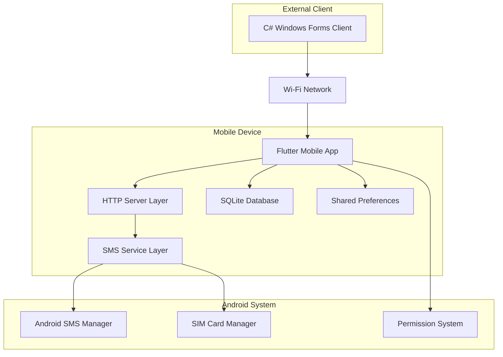
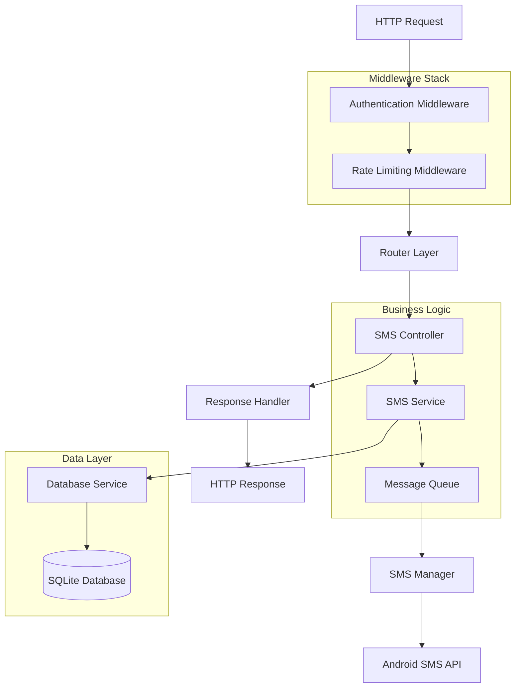
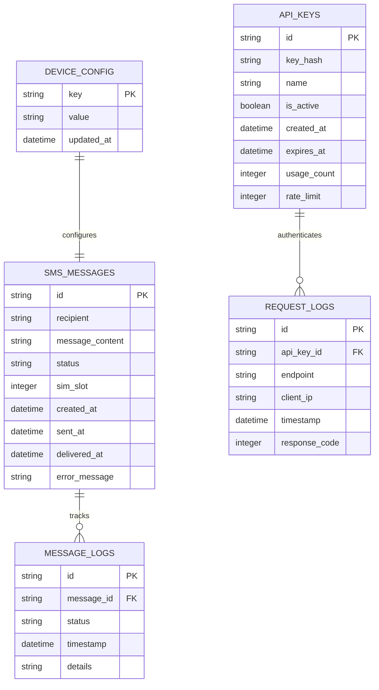

# Flutter SMS Gateway - Technical Architecture Document

## 1. Architecture Design



## 2. Technology Description

- Frontend: Flutter@3.16+ + Material 3 + Provider/Riverpod for state management
- Backend: Dart HTTP Server (shelf@1.4+ + shelf_router@1.1+)
- Database: SQLite (sqflite@2.3+)
- SMS Service: telephony@0.2+ + permission_handler@11.0+
- Background Service: flutter_background_service@5.0+
- Additional: uuid@4.0+, shared_preferences@2.2+, device_info_plus@9.1+

## 3. Route Definitions

| Route | Purpose |
|-------|---------|
| / | Dashboard page with server status and device information |
| /config | Configuration page for API settings and SIM management |
| /logs | Message logs page with SMS history and status tracking |
| /api-keys | API key management page for authentication tokens |

## 4. API Definitions

### 4.1 Core API

**Send Single SMS**
```
POST /api/v1/send-sms
```

Request Headers:
| Header Name | Type | Required | Description |
|-------------|------|----------|-------------|
| Authorization | string | true | Bearer {api_key} |
| Content-Type | string | true | application/json |

Request Body:
| Param Name | Param Type | Required | Description |
|------------|------------|----------|-------------|
| to | string | true | Recipient phone number with country code |
| message | string | true | SMS message content (max 160 chars per segment) |
| sim_slot | integer | false | SIM slot to use (0 or 1), defaults to configured SIM |

Response:
| Param Name | Param Type | Description |
|------------|------------|-------------|
| status | string | success/error |
| message_id | string | Unique UUID for message tracking |
| timestamp | string | ISO 8601 timestamp |
| error | string | Error message if status is error |

Example Request:
```json
{
  "to": "+639123456789",
  "message": "Hello from C# via Flutter SMS Gateway",
  "sim_slot": 0
}
```

Example Response:
```json
{
  "status": "success",
  "message_id": "550e8400-e29b-41d4-a716-446655440000",
  "timestamp": "2025-01-15T10:00:00Z"
}
```

**Send Bulk SMS**
```
POST /api/v1/send-bulk
```

Request Body:
| Param Name | Param Type | Required | Description |
|------------|------------|----------|-------------|
| messages | array | true | Array of SMS message objects |
| messages[].to | string | true | Recipient phone number |
| messages[].message | string | true | SMS message content |
| messages[].sim_slot | integer | false | SIM slot to use |

Response:
| Param Name | Param Type | Description |
|------------|------------|-------------|
| status | string | success/partial/error |
| results | array | Array of individual message results |
| total_count | integer | Total number of messages processed |
| success_count | integer | Number of successfully queued messages |

**Get Device Information**
```
GET /api/v1/device-info
```

Response:
| Param Name | Param Type | Description |
|------------|------------|-------------|
| device_name | string | Android device model |
| ip_address | string | Current local IP address |
| port | integer | HTTP server port |
| sim_info | array | Array of available SIM card information |
| server_status | string | running/stopped |
| version | string | App version |

**Get Message Status**
```
GET /api/v1/message/{message_id}/status
```

Response:
| Param Name | Param Type | Description |
|------------|------------|-------------|
| message_id | string | Message UUID |
| status | string | pending/sent/delivered/failed |
| timestamp | string | Last status update time |
| error_message | string | Error details if failed |

## 5. Server Architecture Diagram



## 6. Data Model

### 6.1 Data Model Definition



### 6.2 Data Definition Language

**SMS Messages Table**
```sql
-- Create SMS messages table
CREATE TABLE sms_messages (
    id TEXT PRIMARY KEY,
    recipient TEXT NOT NULL,
    message_content TEXT NOT NULL,
    status TEXT NOT NULL DEFAULT 'pending' CHECK (status IN ('pending', 'sent', 'delivered', 'failed')),
    sim_slot INTEGER DEFAULT 0 CHECK (sim_slot IN (0, 1)),
    created_at DATETIME DEFAULT CURRENT_TIMESTAMP,
    sent_at DATETIME,
    delivered_at DATETIME,
    error_message TEXT
);

-- Create indexes for performance
CREATE INDEX idx_sms_messages_status ON sms_messages(status);
CREATE INDEX idx_sms_messages_created_at ON sms_messages(created_at DESC);
CREATE INDEX idx_sms_messages_recipient ON sms_messages(recipient);
```

**Message Logs Table**
```sql
-- Create message logs table for detailed tracking
CREATE TABLE message_logs (
    id TEXT PRIMARY KEY,
    message_id TEXT NOT NULL,
    status TEXT NOT NULL,
    timestamp DATETIME DEFAULT CURRENT_TIMESTAMP,
    details TEXT,
    FOREIGN KEY (message_id) REFERENCES sms_messages(id) ON DELETE CASCADE
);

-- Create index for message tracking
CREATE INDEX idx_message_logs_message_id ON message_logs(message_id);
CREATE INDEX idx_message_logs_timestamp ON message_logs(timestamp DESC);
```

**API Keys Table**
```sql
-- Create API keys table
CREATE TABLE api_keys (
    id TEXT PRIMARY KEY,
    key_hash TEXT UNIQUE NOT NULL,
    name TEXT NOT NULL,
    is_active BOOLEAN DEFAULT 1,
    created_at DATETIME DEFAULT CURRENT_TIMESTAMP,
    expires_at DATETIME,
    usage_count INTEGER DEFAULT 0,
    rate_limit INTEGER DEFAULT 100
);

-- Create indexes for authentication
CREATE INDEX idx_api_keys_hash ON api_keys(key_hash);
CREATE INDEX idx_api_keys_active ON api_keys(is_active);
```

**Request Logs Table**
```sql
-- Create request logs table for monitoring
CREATE TABLE request_logs (
    id TEXT PRIMARY KEY,
    api_key_id TEXT,
    endpoint TEXT NOT NULL,
    client_ip TEXT,
    timestamp DATETIME DEFAULT CURRENT_TIMESTAMP,
    response_code INTEGER,
    FOREIGN KEY (api_key_id) REFERENCES api_keys(id)
);

-- Create indexes for monitoring
CREATE INDEX idx_request_logs_timestamp ON request_logs(timestamp DESC);
CREATE INDEX idx_request_logs_api_key ON request_logs(api_key_id);
CREATE INDEX idx_request_logs_endpoint ON request_logs(endpoint);
```

**Device Configuration Table**
```sql
-- Create device configuration table
CREATE TABLE device_config (
    key TEXT PRIMARY KEY,
    value TEXT NOT NULL,
    updated_at DATETIME DEFAULT CURRENT_TIMESTAMP
);

-- Insert default configuration
INSERT INTO device_config (key, value) VALUES
('server_port', '8080'),
('default_sim_slot', '0'),
('rate_limit_per_minute', '60'),
('auto_start_server', 'false'),
('require_api_key', 'true'),
('max_message_length', '160'),
('retry_failed_messages', 'true'),
('max_retry_attempts', '3');
```

**Initial Data Setup**
```sql
-- Create default API key for initial setup
INSERT INTO api_keys (id, key_hash, name, is_active, rate_limit) VALUES
('default-key-001', 'sha256_hash_of_default_key', 'Default API Key', 1, 100);

-- Create sample configuration entries
INSERT OR REPLACE INTO device_config (key, value) VALUES
('app_version', '1.0.0'),
('last_server_start', ''),
('total_messages_sent', '0'),
('server_auto_start', 'false');
```